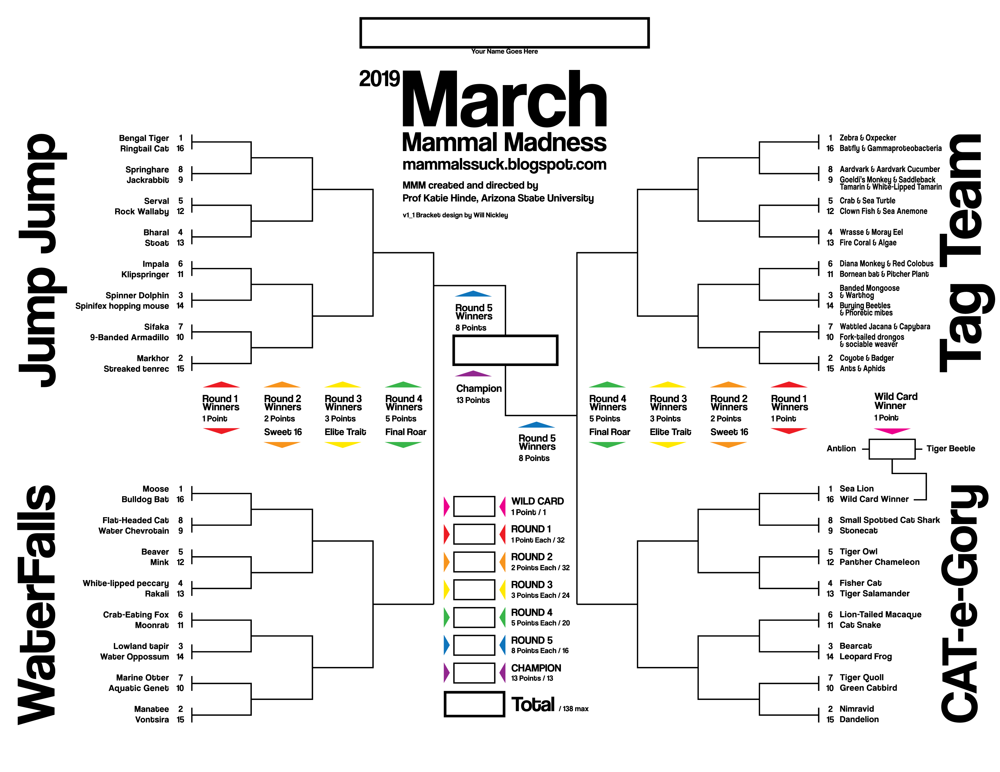

```{r setup, include=FALSE}
knitr::opts_chunk$set(echo = FALSE, warning = FALSE, message = FALSE)
```
Are you playing March Mammal Madness this year?? 

Check out [#2019MMM](https://twitter.com/search?f=tweets&vertical=default&q=%232019MMM&src=typd) for all the latest tweets. Or have a look at the [official website](https://libguides.asu.edu/MarchMammalMadness) for all of the latest updates.



# 2019 MEP Leaderboard
```{r include=FALSE, eval = TRUE}

# I'm lazy so I use the librarian package when loading my packages
# note that using this package will install packages if they are not already 
# contained within your library
librarian::shelf(tidyverse, here, plotly)
################################################################################
####################### MMM_2018 scoring #######################################
################################################################################

# create a list of all csv files in the folder for this year

fils <- list.files (path = "2019MEP", pattern="*.csv") 

# create a list in which to store entries
fl <- list()

#loop through files and add to the list
#using here means that I can easily read files in a subdirectory
for (k in 1:length(fils)){
  fl[[k]] <- read_csv(here("2019MEP",fils[k]))
}


# format the data creating a single vector with all answers from each player
ans <- list()
for(j in 1:length(fl)){
  
  mast <- fl[[j]]
  wild <- mast %>%  select(Wildcard) %>%filter(!is.na(Wildcard))
  a <- select(mast, Round_1:Round_5)
  b <- select(mast, Round_5_1:Round_1_1) %>% rename(Round_1 = Round_1_1 ,Round_2 = 
                                                      Round_2_1, Round_3 = Round_3_1, Round_4 = Round_4_1, 
                                                    Round_5 = Round_5_1 )
  
  cc <- bind_rows(a,b)
  r1 <- cc %>% select(Round_1) %>% filter(!is.na(Round_1))
  r1 <- r1$Round_1
  
  r2 <- cc %>% select(Round_2) %>% filter(!is.na(Round_2))
  r2 <- r2$Round_2
  
  r3 <- cc %>% select(Round_3) %>% filter(!is.na(Round_3))
  r3 <- r3$Round_3
  
  r4 <- cc %>% select(Round_4) %>% filter(!is.na(Round_4))
  r4 <- r4$Round_4
  
  r5 <- cc %>% select(Round_5) %>% filter(!is.na(Round_5))
  r5 <- r5$Round_5
  
  wild <- wild$Wildcard
  
  fin <- mast %>% select(Final) %>% filter(!is.na(Final))
  fin <- fin$Final
  
  out <- c(wild,r1,r2,r3,r4,r5,fin)
  # store the vector in a list
  ans[[j]] <- out
}

### counting points 

######################## generating the answers 
mast <- read_csv(here("MMM19_AAnswers.csv"))
  wild <- mast %>%  select(Wildcard) %>%filter(!is.na(Wildcard))
  a <- select(mast, Round_1:Round_5)
  b <- select(mast, Round_5_1:Round_1_1) %>% rename(Round_1 = Round_1_1 ,Round_2 =
                                                      Round_2_1, Round_3 = Round_3_1, Round_4 = Round_4_1,
                                                    Round_5 = Round_5_1 )

  cc <- bind_rows(a,b)
  r1 <- cc %>% select(Round_1) %>% filter(!is.na(Round_1))
  r1 <- r1$Round_1

  r2 <- cc %>% select(Round_2) %>% filter(!is.na(Round_2))
  r2 <- r2$Round_2

  r3 <- cc %>% select(Round_3) %>% filter(!is.na(Round_3))
  r3 <- r3$Round_3

  r4 <- cc %>% select(Round_4) %>% filter(!is.na(Round_4))
  r4 <- r4$Round_4

  r5 <- cc %>% select(Round_5) %>% filter(!is.na(Round_5))
  r5 <- r5$Round_5

  wild <- wild$Wildcard

  fin <- mast %>% select(Final) %>% filter(!is.na(Final))
  fin <- fin$Final

  master <- c(wild,r1,r2,r3,r4,r5,fin)

# 1 = same 0 = different -- ony get points for answers that are the same as the master


# check where in the list the master file is 
#ans


# create a list of players names

players <- sub(".*_", "", fils) %>% sub(".csv", "",.)
#players <- sub(".csv", "", players)

### check answers 

scorelist <- list()
for (i in 1: length(players)){
  
  ## this checks answers for each round 
  playa <- ans[[i]]
  mstr <- master
  #mstr <- ans[[1]]
  rnd1 <- playa[1:33] == mstr[1:33]
  rnd2 <- playa[34:49] == mstr[34:49]
  sweet <- playa[50:57]==mstr[50:57]
  elite <- playa[58:61]==mstr[58:61]
  roar <- playa[62:63]==mstr[62:63]
  win <- playa[64]==mstr[64]
  
  
  pts <- c(sum(rnd1),sum(rnd2*2), sum(sweet*3), sum(elite*5), sum(roar*8),sum(win*13))
  scorelist[[i]] <- pts
}

leaderboard <- as.data.frame(do.call(rbind, scorelist))
colnames(leaderboard) <- c("Round_1", "Round_2", "Sweet_16", "Elite_8", "Final_roar", "Winner")
#tardy <- c(1,0,0,0,0,0,1,0,0,1,1,1,0)


leaderboard$Player_name <- players
#leaderboard$Tardigrade_tally <- tardy


leaderboard <- leaderboard %>% 
  select(Player_name,  Round_1, Round_2, Sweet_16, Elite_8, 
         Final_roar, Winner) %>% 
  mutate(Total= rowSums(.[2:7])) %>%
  arrange(desc(Total))

# creating a plot with cumulative points 
#create sum column for after each round 
pl_dat <- leaderboard %>% mutate(r2 = Round_1+Round_2) %>% mutate(r3 = r2+Sweet_16)

pl_dat <- leaderboard %>% 
  mutate(r1 =rowSums(.[2:3])) %>% 
  mutate(r2 =rowSums(.[2:4])) %>% 
  mutate(r3 =rowSums(.[2:5])) %>%
  mutate(r4 =rowSums(.[2:6])) %>% 
  mutate(r5 =rowSums(.[2:7])) %>% 
  rename(r6 = Total) %>%
  select(Player_name, r1, r2, r3, r4, r5, r6) %>% 
  gather("Round", "points", 2:7)

pl_dat$Round <- gsub("r","",pl_dat$Round)

p <- ggplot(data=pl_dat, aes(x=Round, y=points, group = Player_name, colour = Player_name)) + 
  geom_line() +
  ggtitle("Point accumulation")
#+ scale_colour_manual(values=cols) 
  
# working out the most popular winner
winners <- vector(length = length(players))

for (i in 1:length(winners)){

  this_one <- ans[[i]]
  winners[i] <- this_one[64]
  
}

outcomes <- data.frame(players, winners)
# creating line breaks for plotting 
levels(outcomes$winners) <- gsub(" ", "\n",levels(outcomes$winners))


### points per round 
# wildcard - 1  1 
# round 1 - 1   2:33
# round 2 - 2   34:49
# sweet 16 - 3  50:57
# elite 8 - 5   58:61
# final roar - 8 62:63
#winner -13      64
```


```{r, }
#what is the most popular winner 

ggplot2::ggplot(data = outcomes) + 
  geom_bar(mapping = aes(x = winners,  fill = players))+
  ggtitle("Predicted winners")+
  theme_classic()


```


```{r eval= TRUE}
knitr::kable(leaderboard)
```

```{r eval=FALSE}
#p
plotly::ggplotly(p)
```


# 2019 BIO2029 
```{r include=FALSE, eval=TRUE}

# I'm lazy so I use the librarian package when loading my packages
# note that using this package will install packages if they are not already 
# contained within your library
librarian::shelf(tidyverse, here, plotly,readxl)
################################################################################
####################### MMM_2018 scoring #######################################
################################################################################

# create a list of all csv files in the folder for this year

fils <- list.files (path = "2019BIO2029", pattern="*.xlsx") 

# create a list in which to store entries
fl <- list()

#loop through files and add to the list
#using here means that I can easily read files in a subdirectory
for (k in 1:length(fils)){
  fl[[k]] <- read_xlsx(here("2019BIO2029",fils[k]))
}


# format the data creating a single vector with all answers from each player
ans <- list()
for(j in 1:length(fl)){
  
  mast <- fl[[j]]
  wild <- mast %>%  select(Wildcard) %>%filter(!is.na(Wildcard))
   a <- select(mast, Round_1..3:Round_5..7) %>% rename(Round_1 = Round_1..3, 
                                                      Round_2 = Round_2..4, 
                                                      Round_3 = Round_3..5,
                                                      Round_4 = Round_4..6, 
                                                    Round_5 = Round_5..7 )
  b <- select(mast, Round_5..9:Round_1..13) %>% rename(Round_1 = Round_1..13,
                                                       Round_2 = Round_2..12,
                                                       Round_3 = Round_3..11, 
                                                       Round_4 = Round_4..10, 
                                                    Round_5 = Round_5..9 )
  cc <- bind_rows(a,b)
  r1 <- cc %>% select(Round_1) %>% filter(!is.na(Round_1))
  r1 <- r1$Round_1
  
  r2 <- cc %>% select(Round_2) %>% filter(!is.na(Round_2))
  r2 <- r2$Round_2
  
  r3 <- cc %>% select(Round_3) %>% filter(!is.na(Round_3))
  r3 <- r3$Round_3
  
  r4 <- cc %>% select(Round_4) %>% filter(!is.na(Round_4))
  r4 <- r4$Round_4
  
  r5 <- cc %>% select(Round_5) %>% filter(!is.na(Round_5))
  r5 <- r5$Round_5
  
  wild <- wild$Wildcard
  
  fin <- mast %>% select(Final) %>% filter(!is.na(Final))
  fin <- fin$Final
  
  out <- c(wild,r1,r2,r3,r4,r5,fin)
  # store the vector in a list
  ans[[j]] <- out
}

### counting points 

# 1 = same 0 = different -- ony get points for answers that are the same as the master

######################## generating the answers 
mast <- read_csv(here("MMM19_AAnswers.csv"))
  wild <- mast %>%  select(Wildcard) %>%filter(!is.na(Wildcard))
  a <- select(mast, Round_1:Round_5)
  b <- select(mast, Round_5_1:Round_1_1) %>% rename(Round_1 = Round_1_1 ,Round_2 =
                                                      Round_2_1, Round_3 = Round_3_1, Round_4 = Round_4_1,
                                                    Round_5 = Round_5_1 )

  cc <- bind_rows(a,b)
  r1 <- cc %>% select(Round_1) %>% filter(!is.na(Round_1))
  r1 <- r1$Round_1

  r2 <- cc %>% select(Round_2) %>% filter(!is.na(Round_2))
  r2 <- r2$Round_2

  r3 <- cc %>% select(Round_3) %>% filter(!is.na(Round_3))
  r3 <- r3$Round_3

  r4 <- cc %>% select(Round_4) %>% filter(!is.na(Round_4))
  r4 <- r4$Round_4

  r5 <- cc %>% select(Round_5) %>% filter(!is.na(Round_5))
  r5 <- r5$Round_5

  wild <- wild$Wildcard

  fin <- mast %>% select(Final) %>% filter(!is.na(Final))
  fin <- fin$Final

  master <- c(wild,r1,r2,r3,r4,r5,fin)

# check where in the list the master file is 
#ans
#master <- ans[[1]]

# create a list of players names


players <- sub(".xlsx", "", fils)
#course <- 
### check answers 

scorelist <- list()
for (i in 1: length(players)){
  
  ## this checks answers for each round 
  playa <- ans[[i]]
  mstr <- master
  rnd1 <- playa[1:33] == mstr[1:33]
  rnd2 <- playa[34:49] == mstr[34:49]
  sweet <- playa[50:57]==mstr[50:57]
  elite <- playa[58:61]==mstr[58:61]
  roar <- playa[62:63]==mstr[62:63]
  win <- playa[64]==mstr[64]
  
  
  pts <- c(sum(rnd1),sum(rnd2*2), sum(sweet*3), sum(elite*5), sum(roar*8),sum(win*13))
  scorelist[[i]] <- pts
}

leaderboard <- as.data.frame(do.call(rbind, scorelist))
colnames(leaderboard) <- c("Round_1", "Round_2", "Sweet_16", "Elite_8", "Final_roar", "Winner")


leaderboard$Player_name <- players

#separate players and courses then do something with the course points
#average points according to each course? or total points - to encourage more players


leaderboard <- leaderboard %>% 
  select(Player_name,Round_1, Round_2, Sweet_16, Elite_8, 
         Final_roar, Winner) %>% 
  mutate(Total= rowSums(.[2:7])) %>%
  arrange(desc(Total))

# creating a plot with cumulative points 
#create sum column for after each round 
pl_dat <- leaderboard %>% mutate(r2 = Round_1+Round_2) %>% mutate(r3 = r2+Sweet_16)

pl_dat <- leaderboard %>% 
  mutate(r1 =rowSums(.[2:3])) %>% 
  mutate(r2 =rowSums(.[2:4])) %>% 
  mutate(r3 =rowSums(.[2:5])) %>%
  mutate(r4 =rowSums(.[2:6])) %>% 
  mutate(r5 =rowSums(.[2:7])) %>% 
  rename(r6 = Total) %>%
  select(Player_name, r1, r2, r3, r4, r5, r6) %>% 
  gather("Round", "points", 2:7)

pl_dat$Round <- gsub("r","",pl_dat$Round)

p <- ggplot(data=pl_dat, aes(x=Round, y=points, group = Player_name, colour = Player_name)) + 
  geom_line() +
  ggtitle("Point accumulation")
#+ scale_colour_manual(values=cols) 
  

# working out the most popular winner
winners <- vector(length = length(players))

for (i in 1:length(winners)){

  this_one <- ans[[i]]
  winners[i] <- this_one[64]
  
}

outcomes <- data.frame(players, winners)
# creating line breaks for plotting 
levels(outcomes$winners) <- gsub(" ", "\n",levels(outcomes$winners))


### points per round 
# wildcard - 1  1 
# round 1 - 1   2:33
# round 2 - 2   34:49
# sweet 16 - 3  50:57
# elite 8 - 5   58:61
# final roar - 8 62:63
#winner -13      64
```

```{r}
ggplot2::ggplot(data = outcomes) + 
  geom_bar(mapping = aes(x = winners,  fill = players))+
  ggtitle("Predicted winners")+
  theme_classic()

```


```{r eval=TRUE}
knitr::kable(leaderboard)
```

```{r eval=FALSE}
#p
plotly::ggplotly(p)
```


# 2018 MEP MMM
Repository containing our MMM2018 bracket entries.

Who will win? Will Kirsty retain her title as queen of the mammals??

Leaderboard
===========

```{r include=FALSE}

# I'm lazy so I use the librarian package when loading my packages
# note that using this package will install packages if they are not already 
# contained within your library
librarian::shelf(tidyverse, here, plotly)
################################################################################
####################### MMM_2018 scoring #######################################
################################################################################

# create a list of all csv files in the folder for this year

fils <- list.files (path = "2018MMM", pattern="*.csv") 

# create a list in which to store entries
fl <- list()

#loop through files and add to the list
#using here means that I can easily read files in a subdirectory
for (k in 1:length(fils)){
  fl[[k]] <- read_csv(here("2018MMM",fils[k]))
}


# format the data creating a single vector with all answers from each player
ans <- list()
for(j in 1:length(fl)){
  
  mast <- fl[[j]]
  wild <- mast %>%  select(Wildcard) %>%filter(!is.na(Wildcard))
  a <- select(mast, Round_1:Round_5)
  b <- select(mast, Round_5_1:Round_1_1) %>% rename(Round_1 = Round_1_1 ,Round_2 = 
                                                      Round_2_1, Round_3 = Round_3_1, Round_4 = Round_4_1, 
                                                    Round_5 = Round_5_1 )
  
  cc <- bind_rows(a,b)
  r1 <- cc %>% select(Round_1) %>% filter(!is.na(Round_1))
  r1 <- r1$Round_1
  
  r2 <- cc %>% select(Round_2) %>% filter(!is.na(Round_2))
  r2 <- r2$Round_2
  
  r3 <- cc %>% select(Round_3) %>% filter(!is.na(Round_3))
  r3 <- r3$Round_3
  
  r4 <- cc %>% select(Round_4) %>% filter(!is.na(Round_4))
  r4 <- r4$Round_4
  
  r5 <- cc %>% select(Round_5) %>% filter(!is.na(Round_5))
  r5 <- r5$Round_5
  
  wild <- wild$Wildcard
  
  fin <- mast %>% select(Final) %>% filter(!is.na(Final))
  fin <- fin$Final
  
  out <- c(wild,r1,r2,r3,r4,r5,fin)
  # store the vector in a list
  ans[[j]] <- out
}

### counting points 

# 1 = same 0 = different -- ony get points for answers that are the same as the master


# check where in the list the master file is 
ans
master <- ans[[9]]

# create a list of players names

players <- sub(".*_", "", fils) %>% sub(".csv", "",.)
#players <- sub(".csv", "", players)

### check answers 

scorelist <- list()
for (i in 1: length(players)){
  
  ## this checks answers for each round 
  playa <- ans[[i]]
  mstr <- ans[[9]]
  rnd1 <- playa[1:33] == mstr[1:33]
  rnd2 <- playa[34:49] == mstr[34:49]
  sweet <- playa[50:57]==mstr[50:57]
  elite <- playa[58:61]==mstr[58:61]
  roar <- playa[62:63]==mstr[62:63]
  win <- playa[64]==mstr[64]
  
  
  pts <- c(sum(rnd1),sum(rnd2*2), sum(sweet*3), sum(elite*5), sum(roar*8),sum(win*13))
  scorelist[[i]] <- pts
}

leaderboard <- as.data.frame(do.call(rbind, scorelist))
colnames(leaderboard) <- c("Round_1", "Round_2", "Sweet_16", "Elite_8", "Final_roar", "Winner")
tardy <- c(1,0,0,0,0,0,1,0,0,1,1,1,0)


leaderboard$Player_name <- players
leaderboard$Tardigrade_tally <- tardy


leaderboard <- leaderboard %>% 
  select(Player_name, Tardigrade_tally, Round_1, Round_2, Sweet_16, Elite_8, 
         Final_roar, Winner) %>% 
  slice( -9) %>%
  mutate(Total= rowSums(.[2:8])) %>%
  arrange(desc(Total))

# creating a plot with cumulative points 
#create sum column for after each round 
pl_dat <- leaderboard %>% mutate(r2 = Round_1+Round_2) %>% mutate(r3 = r2+Sweet_16)

pl_dat <- leaderboard %>% 
  mutate(r1 =rowSums(.[2:3])) %>% 
  mutate(r2 =rowSums(.[2:4])) %>% 
  mutate(r3 =rowSums(.[2:5])) %>%
  mutate(r4 =rowSums(.[2:6])) %>% 
  mutate(r5 =rowSums(.[2:7])) %>% 
  rename(r6 = Total) %>%
  select(Player_name, r1, r2, r3, r4, r5, r6) %>% 
  gather("Round", "points", 2:7)

pl_dat$Round <- gsub("r","",pl_dat$Round)

p <- ggplot(data=pl_dat, aes(x=Round, y=points, group = Player_name, colour = Player_name)) + 
  geom_line() +
  ggtitle("Point accumulation")
#+ scale_colour_manual(values=cols) 
  


### points per round 
# wildcard - 1  1 
# round 1 - 1   2:33
# round 2 - 2   34:49
# sweet 16 - 3  50:57
# elite 8 - 5   58:61
# final roar - 8 62:63
#winner -13      64
```


```{r}
knitr::kable(leaderboard)
```

```{r}
#p
plotly::ggplotly(p)
```

